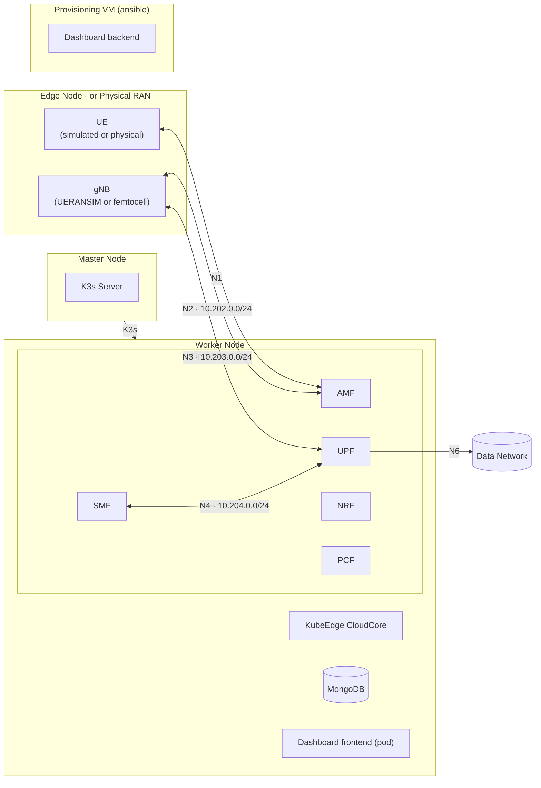

<p align="center">
  
</p>

<h1 align="center">KELT</h1>

<p align="center">
  <strong>Kubernetes-Edge Lightweight Testbed</strong><br>
  A 5G core and cloud-edge testbed that runs on one machine, built from scratch with Vagrant and Ansible.
</p>

<p align="center">
  <a href="LICENSE"></a>
  <a href="https://jacobbista.github.io/kelt/"></a>
</p>

## Status

A research testbed under active development. Components are tiered by maturity:

- **Supported** (validated, reproducible): core 5G deployment, VXLAN overlays, dashboard, IAM, node and NF metrics, physical RAN.
- **Experimental** (present, not fully validated): CAMARA location and positioning, UERANSIM, KubeEdge edge node, UPF-MEC, log and alerting stack.
- **Planned** (no working code yet): edge provisioning from the dashboard, MEC scheduling, O-RAN RIC, NWDAF.

CAMARA location and positioning are built and deploy, and Supported is where they
are headed, but the end-to-end validation is not done yet.

Full matrix and reproducibility scope: [docs/status.md](docs/status.md).

## How It Works

The cluster is up to three nodes (K3s master, worker, and an optional KubeEdge edge), brought up and configured by a separate Ansible provisioning VM. The worker runs the Open5GS core network functions (AMF, SMF, UPF, NRF, and others) alongside KubeEdge CloudCore. The edge node hosts EdgeCore with UERANSIM gNB and UEs, or a physical femtocell. OVS+VXLAN tunnels carry the 5G control and user-plane traffic between them with per-interface isolation.

### Where it sits in a 5G system


The figure above is the 3GPP service-based architecture, for reference. The network
functions themselves come from Open5GS. What KELT adds is the deployment: the
functions run as pods, and the interfaces between them (N1, N2, N3, N4, N6) each
get their own VXLAN overlay instead of sharing one flat network.

### Testbed Implementation



## Getting Started

**Host OS:** Ubuntu 24.04.4 LTS (desktop and server). Other Linux distributions are untested.

**Prerequisites:** Vagrant ≥ 2.3.0, VirtualBox ≥ 6.1.0, 16 GB RAM. The first-run wizard checks these and offers to install [gum](https://github.com/charmbracelet/gum) and the `kelt` command.

```bash
git clone https://github.com/Jacobbista/kelt.git
cd kelt
./testbed-config           # first run launches the onboarding wizard
```

The wizard verifies host requirements (vagrant, VirtualBox, vboxusers
group, CPU virtualization), installs gum, puts `kelt` on your PATH, and
initializes the deployment profile. After that it works from any directory:

```bash
kelt up                    # bring the cluster up
kelt                       # open the interactive menu
kelt autostart on          # bring the cluster up automatically on boot
kelt help                  # full reference
```

**Verify after deployment:**
```bash
vagrant ssh master
sudo k3s kubectl get nodes
sudo k3s kubectl get pods -n 5g
```

**Full guides:**
- End-user and agent operations: [QUICKSTART.md](QUICKSTART.md)
- Detailed walkthrough: [docs/getting-started.md](docs/getting-started.md)
- Tool reference: [docs/tools/testbed-config.md](docs/tools/testbed-config.md)

## Stack

VMs run Ubuntu 22.04 (Jammy).

| Layer | Technology | Version |
|-------|------------|---------|
| Container orchestration | K3s | v1.30.6+k3s1 |
| Edge computing | KubeEdge | 1.21.0 |
| 5G core | Open5GS | 2.7.7 (patched; per-NF images built in [5g-nf-platform](https://github.com/Jacobbista/5g-nf-platform)) |
| RAN simulation | UERANSIM | 3.2.7 ([jacobbista/comnetsemu-ueransim](https://hub.docker.com/r/jacobbista/comnetsemu-ueransim)) |
| Overlay networking | OVS + VXLAN | OVS CNI 0.34.3 |
| Multi-homed pods | Multus CNI | 4.1.0 |
| IPAM | Whereabouts | 0.7.0 |
| Operations | Dashboard (FastAPI + React) | |

## 5G Interfaces

| Interface | Subnet | Protocol | Path |
|-----------|--------|----------|------|
| N1 | 10.201.0.0/24 | NAS / SCTP | UE ↔ AMF |
| N2 | 10.202.0.0/24 | NGAP / SCTP | gNB ↔ AMF |
| N3 | 10.203.0.0/24 | GTP-U / UDP | gNB ↔ UPF |
| N4 | 10.204.0.0/24 | PFCP / UDP | SMF ↔ UPF |
| N6c | 10.207.0.0/24 | IP / NAT | UPF-Cloud ↔ internet |
| N6m | 10.208.0.0/24 | IP routing | UPF-Cloud ↔ MEC data network |
| N6e | 10.206.0.0/24 | IP routing | UPF-Edge ↔ MEC (disabled) |

## Testing

```bash
cd tests
make test    # run all enabled suites
```

For individual suites and how to write new ones, see the [Testing Guide](docs/development/testing.md).

## Documentation

Full documentation lives in [docs/](docs/README.md).

**Architecture**
- [System Overview](docs/architecture/overview.md): node roles, component placement, deployment flow
- [Virtualization Layers](docs/architecture/virtualization-layers.md): 5-layer stack from host to 5G NFs
- [Network Topology](docs/architecture/network-topology.md): OVS, VXLAN, Multus from first principles
- [5G Interfaces](docs/architecture/5g-interfaces.md): N1–N6 subnets, IPs, ports, verification

**Deployment**
- [Deployment Phases](docs/deployment/phases.md): what each of the 12 phases does
- [Server / NUC Setup](docs/deployment/server-setup.md): headless server deployment
- [Physical RAN Integration](docs/deployment/physical-ran.md): connect a real femtocell

**Operations**
- [Troubleshooting](docs/operations/troubleshooting.md): start here when something is wrong
- [Handbook](docs/operations/handbook.md): operator cheat-sheet (IPs, ports, commands)
- [Runbooks](docs/runbooks/): step-by-step diagnostics for NGAP, PFCP, GTP-U, OVS, Multus

**Dashboard**
- [Overview](docs/dashboard/overview.md): architecture, access URLs, security model
- [API Reference](docs/dashboard/api-reference.md): REST and WebSocket endpoints

## Companion Repositories

KELT pulls container images built and versioned in separate repositories:

- [**5g-nf-platform**](https://github.com/Jacobbista/5g-nf-platform): per-NF Open5GS images (AMF, SMF, UPF, and the rest) with research patches, built and published via CI. Pinned by tag in `ansible/group_vars/all.yml`.
- [**5g-northbound**](https://github.com/Jacobbista/5g-northbound): CAMARA gateway and positioning engine / demo images for the optional northbound addons.

The `5g-probe` UE measurement tool ships in this repository under [`5g-probe/`](5g-probe/).

## License

Copyright 2024–2026 Jacopo Bennati. Licensed under the [Apache License 2.0](LICENSE).

Third-party component licenses are listed in [NOTICE](NOTICE).

## Acknowledgements

This project started as a course project in the [Granelli Lab](https://www.granelli-lab.org)
(Prof. Fabrizio Granelli, University of Trento), and took its starting point from
[ComNetsEmu](https://www.granelli-lab.org/researches/relevant-projects/comnetsemu-sdn-nfv-emulator),
the lab's SDN/NFV emulator. It went in a different direction: ComNetsEmu builds its
topologies with Mininet and Docker, while KELT schedules containers on Kubernetes and
carries the 5G interfaces over OVS/VXLAN overlays.

Built with [K3s](https://k3s.io), [KubeEdge](https://kubeedge.io), [Open5GS](https://open5gs.org), [UERANSIM](https://github.com/aligungr/UERANSIM), and [Multus CNI](https://github.com/k8snetworkplumbingwg/multus-cni).
